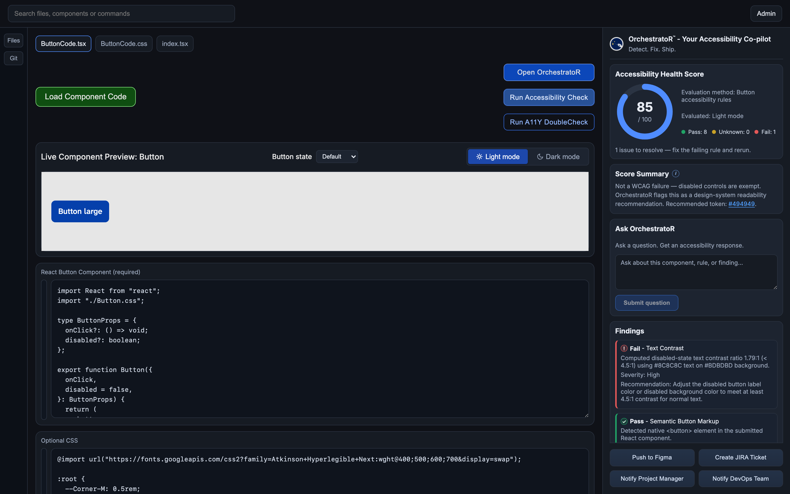
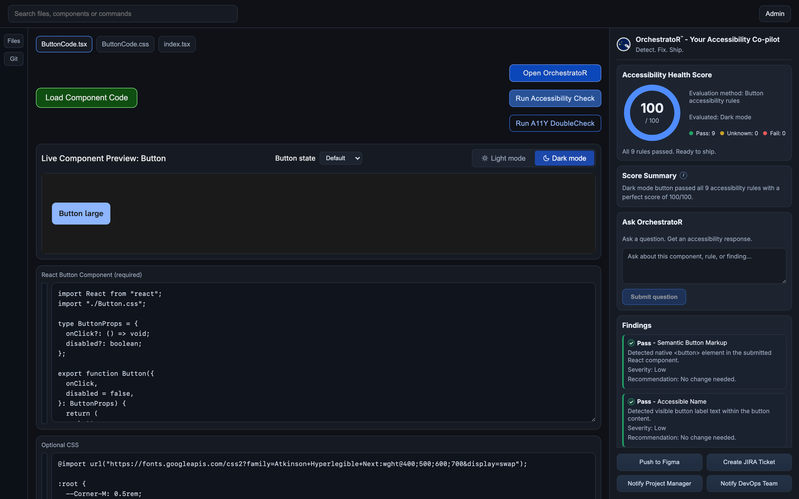

# OrchestratoR™

**Your accessibility co-pilot — Detect. Fix. Ship.**

### ▶ [Try the live demo](https://demo.orchestratorlabs.ai)

No install, nothing to run. Load the sample component, run the check, and fix the
failing rule in the editor to watch the score change.

The hosted demo covers the deterministic half — all nine rules, the score, the
line-linked findings and the live light/dark preview. The Claude-backed features
need the local Python service and are not included; see
[Running it locally](#running-it-locally).

---

OrchestratoR aligns teams across design, product, engineering, and compliance —
detecting, fixing, and shipping accessible experiences faster.

Every accessibility issue caught upstream saves hours downstream, turning
compliance into measurable time and cost savings.

---

> ### ⚠️ Portfolio project — please read
>
> This repository is published **for portfolio and demonstration purposes only**.
> It is a proof of concept, not a product, and not an open source project.
>
> - **All rights reserved.** No license to use, modify, or redistribute is
>   granted — see [LICENSE](LICENSE).
> - **Not accepting contributions.** Issues and pull requests are not being
>   monitored.
> - **No support or warranty.** Provided as-is.
>
> It is shared so the approach and implementation can be *read*, not adopted.

---



Deterministic rules produce the score. Claude explains it. Here the contrast rule
reports a failure, and the summary adds the nuance the rule cannot: disabled
controls are exempt under WCAG, so this is a design-system readability
recommendation rather than a violation — with a specific replacement token.

### The same component, evaluated in dark mode



Identical markup, identical rules — **85 in light, 100 in dark.** The failure is
in the light theme's disabled tokens (`--Text-Disabled: #8C8C8C` on
`--Bg-Disabled: #BDBDBD`, roughly 1.79:1), which is exactly the kind of
theme-specific gap that survives design review and manual QA.

---

## What it does

Paste a button component's React and CSS into the workspace and OrchestratoR
evaluates it against nine accessibility rules, returning a health score with
per-rule findings that link back to the exact lines responsible.

- **Rule engine** — semantic markup, accessible name, keyboard operability,
  focus visibility, text contrast, non-text contrast, target size, disabled
  state, and state coverage
- **Live preview** — renders the component in a shadow root across five states
  (default, hover, active, disabled, focused) in both light and dark mode
- **A11Y DoubleCheck** — an optional second pass using Claude to sanity-check
  the deterministic findings
- **Inline annotations** — each finding highlights the CSS or TSX lines it came
  from

### Scope of the proof of concept

Being candid about the boundaries:

- Evaluates **buttons only**
- Locates CSS by matching a known selector (`.btn`, falling back to `button`),
  so arbitrary CSS may not be fully analysed
- No automated test suite

## Tech stack

**Frontend** — React 18, TypeScript, Vite
**Backend** — Python, Flask, Anthropic SDK

## Running it locally

Both halves need to be running. The frontend calls the backend on
`http://127.0.0.1:5001`.

### 1. Backend

```bash
pip install -r requirements.txt
cp .env.example .env        # then add your Anthropic API key
python app.py               # serves on http://127.0.0.1:5001
```

Your `.env` needs:

```
ANTHROPIC_API_KEY=sk-ant-...
ANTHROPIC_MODEL=claude-sonnet-4-6
```

The key is read server-side only and is never exposed to the browser. `.env` is
gitignored — do not commit it.

### 2. Frontend

```bash
npm install
npm run dev
```

Then open the URL Vite prints, click **Load Component Code**, and run the
evaluation.

> **Without the backend running**, the workspace, rule engine, scoring, line
> annotations and live preview all work. The Claude-backed features do not error —
> A11Y DoubleCheck renders as unavailable with an explanation, Ask OrchestratoR
> states the same, and the Score Summary falls back to a summary derived from the
> rule results and labelled as such.

## Documentation

See [docs/](docs/) for the evaluation rules, scoring policy, RAG registry, and
wireframe specifications.

## Notes

The seeded sample scores **85 in light mode and 100 in dark mode**. That is not
a bug: the light theme's disabled tokens (`--Text-Disabled: #8C8C8C` on
`--Bg-Disabled: #BDBDBD`) sit at roughly 1.79:1, below the 4.5:1 threshold, so
the text-contrast rule correctly fails. The dark theme's equivalents pass.

---

Copyright © 2026 orchestratorlabs. All rights reserved.
