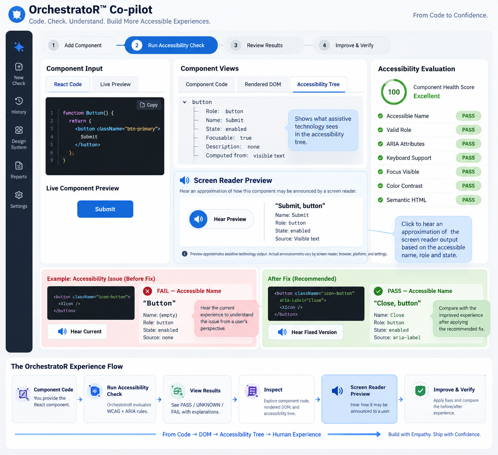

# OrchestratoR™ SME Demo Feedback

## Accessibility SME Review — September 18, 2026

### Session Purpose

A live product demo of OrchestratoR™ was conducted with three accessibility SMEs:

* Kelsey
* KJ
* Gouri

The session reviewed OrchestratoR's current component-level accessibility evaluation workflow, including:

* React component evaluation
* Deterministic accessibility rules
* Design-system-aware evaluation
* WCAG evaluation
* PASS / UNKNOWN / FAIL states
* Accessibility Health Score
* RAG-supported evidence
* DoubleCheck validation
* Human-in-the-loop review

The SMEs responded positively to the overall product direction and suggested several future-state capabilities.

---

# SME Feedback

## 1. Rendered DOM / Accessibility Tree Inspection

**SME:** Gouri

### Request

Provide another view that allows developers and accessibility SMEs to inspect what the component becomes after rendering rather than looking only at the submitted React source code.

Potential views:

* Component Code
* Rendered DOM
* Accessibility Tree

### Product Rationale

React source code does not always represent the final browser DOM.

A rendered DOM view would help users understand exactly what HTML and attributes are produced by the component.

An Accessibility Tree view could go one step further and expose information relevant to assistive technologies, such as:

* Accessible Name
* Role
* State
* Description
* Focusability
* ARIA relationships

### Potential User Value

This creates a clearer relationship between:

`Source Code → Rendered DOM → Accessibility Tree → Assistive Technology Experience`

It could also allow accessibility findings to highlight the exact DOM or accessibility-tree node responsible for a PASS, UNKNOWN, or FAIL result.

### Priority

High

### Approximate MVP Effort

* Rendered DOM view: relatively low-to-medium complexity
* Accessibility Tree inspection: medium complexity

---

# 2. Add ARIA Evaluation Rules

**SME:** KJ

### Request

Expand the OrchestratoR deterministic accessibility evaluator to include ARIA-specific evaluation.

### Product Direction

ARIA should not be implemented as one generic rule.

ARIA evaluation should become part of each component's deterministic rule package.

Examples could include:

* Valid ARIA Role
* Valid ARIA Attributes
* Required ARIA Attributes
* ARIA State Validity
* Accessible Name
* ARIA Relationships
* Native Semantics Preferred
* State / Behavior Alignment

Example:

`Button Component`
→ WCAG rules
→ Design-system rules
→ ARIA rules

Future examples:

`Modal`
→ Dialog role
→ Accessible name
→ Focus management
→ aria-modal
→ Escape behavior
→ focus return

`Tabs`
→ tab / tablist / tabpanel relationships
→ aria-selected
→ keyboard interaction
→ focus state

### Product Rationale

ARIA evaluation strengthens OrchestratoR's existing deterministic rules engine rather than introducing a separate accessibility system.

This is highly aligned with the future goal of making OrchestratoR component-aware and design-system-aware.

### Priority

Very High

### Recommended Direction

This should be one of the next major evaluator expansions.

---

# 3. Accessibility Evidence / Audit Reporting

**SME:** Kelsey

### Problem Identified

Accessibility teams may need to collect evidence during:

* Accessibility audits
* Compliance reviews
* Internal investigations
* Legal inquiries
* Questions about whether a component was compliant when released

The required evidence often exists across different systems and can be difficult and time-consuming to reconstruct later.

### Future-State Opportunity

Create an Accessibility Evidence system within OrchestratoR.

Rather than describing this initially as an automated "legal compliance report," use language such as:

**Accessibility Evidence Report**

or

**Accessibility Assurance Record**

OrchestratoR should collect evidence that supports human accessibility, compliance, and legal review rather than claiming to make a legal determination itself.

### Evidence That Could Be Captured

#### Design / Figma Evidence

* Component name
* Figma component ID
* Design-system version
* Design token version
* Accessibility rule-package version
* WCAG criteria evaluated
* ARIA requirements
* PASS / UNKNOWN / FAIL state
* Evaluation timestamp

#### Development Evidence

* React component version
* Git commit SHA
* Repository
* Branch or release
* CLAUDE.md version
* DESIGN_SYSTEM.md version
* Component accessibility `.md` rules
* Deterministic evaluation results
* ARIA results
* DoubleCheck results

#### Human Approval Evidence

* Developer approval
* Accessibility reviewer
* Date/time
* Approved
* Needs Changes
* Exception
* Notes

#### Production Evidence

* Component version shipped
* Build identifier
* Deployment timestamp
* Final evaluation state

### Evidence Ledger

Before building a full multi-agent reporting system, create an underlying:

**Accessibility Evidence Ledger**

Each evaluation record should preserve:

`Component`
→ `Version`
→ `Rule Package`
→ `WCAG / ARIA Criteria`
→ `Evaluation Result`
→ `Timestamp`
→ `Evaluator Version`
→ `Human Approval`
→ `Git / Build Reference`

This ledger becomes the source of truth.

### Future Multi-Agent Model

Possible specialized agents:

#### Design Evidence Agent

Collects Figma and design-system evidence.

#### Code Evidence Agent

Collects repository, component, Markdown rule package, and code-level evaluation evidence.

#### Validation Agent

Checks WCAG / ARIA evidence and identifies missing or UNKNOWN information.

#### Approval Agent

Checks whether required human approvals exist.

#### Reporting Agent

Compiles evidence into scheduled accessibility reports.

### Possible Monthly Output

`September 2026 Accessibility Evidence Report`

The report could summarize:

* Components evaluated
* Component versions
* PASS / UNKNOWN / FAIL
* Design-system compliance
* WCAG mappings
* ARIA evaluation
* DoubleCheck status
* Human approval
* Exceptions
* Production status
* Timestamps
* Evidence source

### Strategic Value

This potentially expands OrchestratoR from:

**Accessibility Evaluation Tool**

into:

**Accessibility Evidence & Governance Platform**

### Priority

Very High strategically.

Build the Evidence Ledger before attempting the complete multi-agent system.

---

# 4. External Accessibility Tool Integrations

**SME:** KJ

### Request

Allow OrchestratoR users to invoke other accessibility evaluation tools without leaving the copilot.

Potential tools mentioned:

* Lighthouse
* Deque
* axe / axe-core

### Recommended Architecture

OrchestratoR should remain the orchestration and reasoning layer.

Potential model:

`OrchestratoR Deterministic Rules`
+
`ARIA Rules`
+
`axe-core Validation`
+
`DoubleCheck`
+
`Human Review`

Results from external tools should be normalized into the OrchestratoR interface rather than simply embedding several separate reports.

### Important Consideration

Avoid unnecessary duplication between tools that use similar underlying accessibility rules.

Start with one external validation engine and determine whether it adds evidence that OrchestratoR does not already provide.

### Recommended First Integration

Investigate axe-core first because it can provide rendered-interface automated accessibility testing and can complement OrchestratoR's design-system-aware deterministic evaluation.

### Priority

High, but after strengthening the core deterministic and ARIA evaluation architecture.

---

# 5. PASS State Validation

**SME:** KJ

### Feedback

KJ specifically praised OrchestratoR for displaying PASS results.

Many accessibility tools emphasize failures but do not clearly communicate what has been successfully evaluated.

### Product Principle

Preserve:

* PASS
* UNKNOWN
* FAIL

Do not reduce the product to an issue-only model.

PASS should eventually become evidence-rich.

Example:

**PASS — Accessible Name**

* Result: Pass
* Rule: Accessible Name
* WCAG: 4.1.2
* Component: Button
* Rule package: Button v1.4
* Evaluated: September 18, 2026
* Evaluation source: Deterministic
* ARIA validation: Pass

This turns PASS from a visual status into positive evidence that can later be used by the Accessibility Evidence Ledger.

### Priority

Core product principle. Preserve.

---

# 6. Screen Reader Preview

**Concept visual:**


### Origin

This concept emerged from the ARIA discussion after the SME session.

### Feature Concept

Add a feature called:

**Screen Reader Preview**

The purpose is to translate technical accessibility semantics into something developers can experience.

After OrchestratoR calculates the component's:

* Accessible Name
* Role
* State
* Description
* ARIA attributes

the developer can hear an approximation of how that information may be communicated by assistive technology.

Example:

Accessibility Tree:

* Name: Submit
* Role: button
* State: enabled

Screen Reader Preview:

`🔊 Hear Preview`

Approximate output:

> "Submit, button"

### Important Product Constraint

Do not present this as an actual VoiceOver, NVDA, JAWS, or TalkBack simulation.

Actual screen-reader output can differ depending on:

* Screen reader
* Browser
* Operating system
* User preferences
* Context
* Verbosity settings

Use wording such as:

> Hear an approximation of how this component's accessible name, role, and state may be communicated to a screen-reader user.

### Recommended Flow

`React Component`

→ `Run Accessibility Check`

→ `Deterministic WCAG Rules`

→ `ARIA Rules`

→ `Accessibility Tree`

→ `Screen Reader Preview`

→ `DoubleCheck`

→ `Human Approval`

### PASS Example

Component:

```html
<button>Submit</button>
```

Result:

**PASS — Accessible Name**

Accessibility output:

* Name: Submit
* Role: button
* State: enabled

Preview:

`🔊 "Submit, button"`

### FAIL Example

Component:

```html
<button className="icon-button">
  <XIcon />
</button>
```

Result:

**FAIL — Accessible Name**

Current accessibility output:

* Name: empty
* Role: button

Current Preview:

`🔊 "Button"`

Recommended fix:

```html
<button
  className="icon-button"
  aria-label="Close"
>
  <XIcon />
</button>
```

After Fix:

* Name: Close
* Role: button

Improved Preview:

`🔊 "Close, button"`

This creates a useful:

**Hear Current → Apply Fix → Hear Improved**

interaction.

### UNKNOWN Example

If OrchestratoR cannot determine the accessible name or state from the available evidence:

**UNKNOWN — Screen Reader Preview**

Message:

> Accessible output cannot be reliably determined from the submitted component evidence.

Do not generate speculative audio.

Unknown must remain Unknown.

### Potential Implementation

A future first version could:

1. Use the deterministic evaluator to calculate name, role, and state.
2. Generate a normalized preview string.
3. Use browser speech synthesis to play the preview.
4. Clearly label the output as an approximation.

**Do not implement this now. This section documents a possible future direction only.**

Do not use the audio itself to determine PASS / FAIL.

The evaluator determines the accessibility result.

The audio is an explanatory UX layer.

---

# Future Product Architecture

The SME feedback suggests the following possible longer-term OrchestratoR architecture:

`Figma Component`

↓

`Design-System Rules`

↓

`React Component`

↓

`Deterministic WCAG Evaluation`

↓

`ARIA Evaluation`

↓

`Rendered DOM`

↓

`Accessibility Tree`

↓

`Screen Reader Preview`

↓

`External Validation — axe / Deque`

↓

`DoubleCheck`

↓

`Human Review / Approval`

↓

`Git / CI/CD Evidence`

↓

`Production`

↓

`Accessibility Evidence Ledger`

↓

`Accessibility Evidence Report`

---

# Emerging Product Vision

The session suggests that OrchestratoR does not need to become another generic accessibility scanner.

The stronger opportunity is:

> **A Design-System-aware deterministic accessibility engine where each component carries its own validated accessibility rule package, and where evaluation evidence follows that component from design through development, approval, and release.**

The broader potential workflow becomes:

**Evaluate → Inspect → Experience → Verify → Approve → Record → Report**

OrchestratoR could potentially answer not only:

> "Does this component currently pass the accessibility evaluation?"

but also:

> "What was evaluated, against which rules, using which component version, when was it evaluated, what remained unknown, what independent evidence supported the result, and who approved the component before it shipped?"

---

# Potential Product Priority

These priorities are exploratory and are **not implementation instructions**.

## Priority 1 — Core Evaluation Expansion

Consider adding deterministic ARIA evaluation to component rule packages.

## Priority 2 — Evidence Foundation

Consider an Accessibility Evidence Ledger for persisting evaluation metadata.

## Priority 3 — Inspection & Explainability

Consider Rendered DOM and Accessibility Tree views.

## Priority 4 — Screen Reader Preview

Consider translating accessibility-tree output into an understandable audio preview.

## Priority 5 — External Validators

Consider integrating axe-core or other appropriate external evaluation engines.

## Priority 6 — Automated Reporting

Consider scheduled evidence collection and Accessibility Evidence Reports.

## Priority 7 — Multi-Agent Governance

Consider specialized agents to collect, validate, reconcile, and report accessibility evidence across Figma, source code, evaluation tools, approvals, and production.

---

# Product Principle

Maintain the existing OrchestratoR trust model:

**PASS = sufficient evidence supports the requirement**

**UNKNOWN = available evidence is insufficient to make a reliable determination**

**FAIL = evidence demonstrates that the requirement is not satisfied**

Never convert UNKNOWN into PASS or FAIL simply to produce a more complete-looking report.

Human review remains part of the accessibility release process.

---

# Current Decision Status

**No implementation decision has been made yet.**

These concepts are being preserved as SME research, product opportunities, and future-state possibilities while I determine what OrchestratoR should build next.

**Do not treat any feature in this document as approved for implementation.**

**Do not create code, components, APIs, agents, data structures, branches, prototypes, tickets, dependencies, or implementation plans unless I explicitly request that work later.**

---

`Status: Product research / future-state exploration — not approved for implementation`

`Source: Accessibility SME OrchestratoR™ demo — September 18, 2026`

`Next review: Revisit during OrchestratoR component-rule and MCP architecture expansion`
