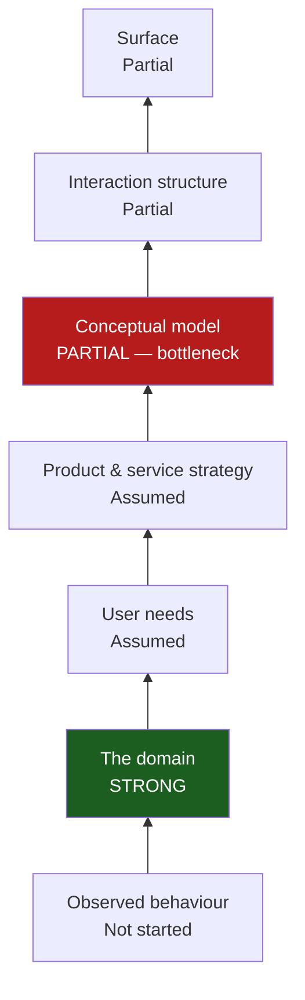

# Layers of Product Design — Session Log

Design decisions surfaced using the *Layers of Product Design* framework
(seven layers, three zones). Each section records **decisions made**,
**decisions uncovered**, and **open questions** — not just diagrams.

Diagrams are Mermaid and render natively in VSCode with the
[Markdown Preview Mermaid Support](https://marketplace.visualstudio.com/items?itemName=bierner.markdown-mermaid)
extension.

---

## Session 1 — `/layers-orient` (2026-07-28)

Rapid diagnostic across all seven layers to locate the bottleneck.

**Context given:** OrchestratoR is a published portfolio POC, not a product
seeking market fit. No user research exists — the design rests on the author's
own accessibility judgement. The trigger for this session was sharpening the
thinking so the repo holds up to a careful reader.

### Decision landscape

| Layer | State | Notes |
|---|---|---|
| Observed behaviour | Not started | No research. Own judgement. A deliberate choice for a POC, now stated rather than implied. |
| The domain | **Strong** | WCAG 2.1, W3C/WAI, DOJ ADA Web Rule named as source of truth; nine rules traceable to real criteria; `rag/` registry files. The one solid foundation. |
| User needs | Assumed | No job stories. Target user differs across three documents. |
| Product & service strategy | Assumed | "Issues caught upstream save hours downstream" is a business-outcome claim never connected to a specific need or measurement. |
| Conceptual model | **Partial — bottleneck** | Objects exist in the type system, but three unresolved tensions (below). |
| Interaction structure | Partial | Happy path specified and built. Temporal states (empty / loading / partial / failure) thin. |
| Surface | Partial | Built, light and dark. No named design system; explicit "avoid over-design" constraint. |

### Decisions uncovered

Three at the conceptual model layer, all visible in the type system:

**1. Two verdict vocabularies that do not reconcile.**
`RuleStatus` is `Pass | Unknown | Fail`
([types/evaluation.ts:1](../../src/features/orchestrator/types/evaluation.ts#L1)).
`A11yDoubleCheckResult.status` is `PASS | PARTIAL | FAIL`
([:10](../../src/features/orchestrator/types/evaluation.ts#L10)).
Different casing, and the middle terms are different concepts — `Unknown`
means *no evidence available*, `PARTIAL` means *partially compliant*.
Three separate quality signals coexist (`healthScore`, `confidenceScore`,
`shipReadiness`) with no stated relationship, and the latter two are typed as
bare `string`, so their vocabularies are not pinned anywhere.
→ OOUX **masked** failure mode: two distinct verdict objects presented as one.

**2. What is the health score a property of?**
Unknown is excluded from the score denominator
([buttonEvaluator.ts:167-172](../../src/features/orchestrator/evaluator/buttonEvaluator.ts#L167-L172)),
so a component with 1 pass / 0 fail / 8 unknown scores **100**. The seeded
sample also scores 85 in light mode and 100 in dark. The score is therefore a
property of a *component × theme × evidence-available* triple, not of a
component — but the model does not say so and the panel shows one number.

**3. No evaluation identity or history.**
`EvaluationResult` has no id, timestamp, or component reference. Whether an
evaluation persists, whether "did this improve?" is answerable, and what a
Component is as an object (currently: pasted text) are all undecided.

### Flagged — cross-cutting

Target user is inconsistent across artefacts:

- "design, product, engineering, and compliance" — [README.md:5](../../README.md#L5)
- "developers and engineers" — [orchestrator_wireframe_spec.md:9](../orchestrator_wireframe_spec.md#L9)
- "a designer or engineer" — [orchestrator-architecture-diagram.md:59](../orchestrator-architecture-diagram.md#L59)

A user-needs wobble that propagates upward into what the panel should say and
who the fixes are written for.

### Bottleneck analysis

**Conceptual model.** Strictly, the framework points at the lowest weak layer,
which is observed behaviour. That was overridden deliberately: this is a
portfolio POC, so user research is the wrong investment, and the conceptual
model carries *risky decisions already made* rather than decisions consciously
skipped — a more urgent category. The tradeoff is named rather than ignored.

### Open questions

- Do `Unknown` and `PARTIAL` collapse into one vocabulary, or are they
  genuinely different objects that need distinct visual treatment?
- Is the health score per-theme, or is there a single component score with
  theme as a dimension beneath it?
- Should an Evaluation persist? (Design question first; storage follows.)
- Which single audience do the fixes address?

### Next

`/layers-conceptual-model` — resolve the verdict vocabulary clash, pin what the
score is a property of, and settle Component and Evaluation as objects.
