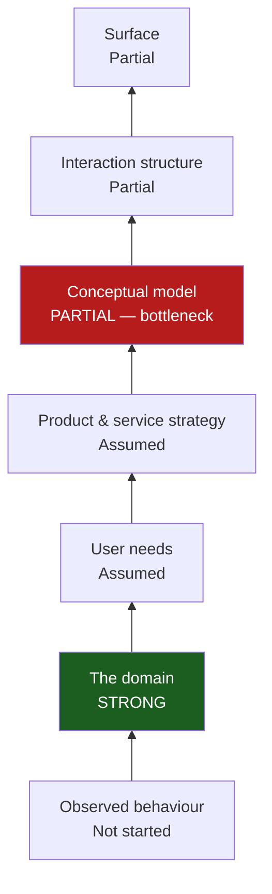
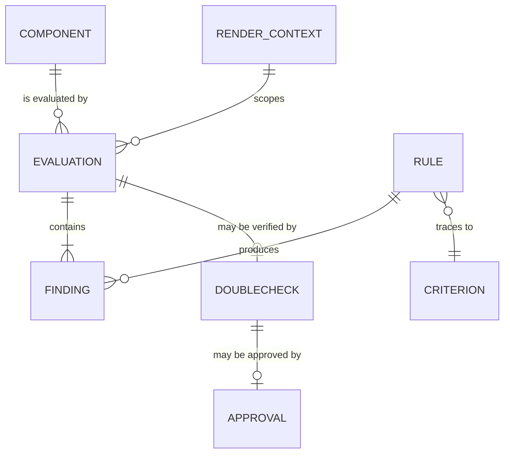
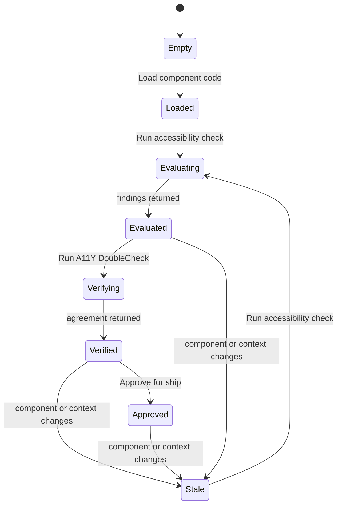

# Layers of Product Design — Session Log

Design decisions surfaced using the *Layers of Product Design* framework
(seven layers, three zones). Each section records **decisions made**,
**decisions uncovered**, and **open questions** — not just diagrams.

Diagrams are Mermaid and render natively in VSCode with the
[Markdown Preview Mermaid Support](https://marketplace.visualstudio.com/items?itemName=bierner.markdown-mermaid)
extension.

---

## Session 1 — `/layers-orient` (2026-07-28)

Rapid diagnostic across all seven layers to locate the bottleneck.

**Context given:** OrchestratoR is a published portfolio POC, not a product
seeking market fit. No user research exists — the design rests on the author's
own accessibility judgement. The trigger for this session was sharpening the
thinking so the repo holds up to a careful reader.

### Decision landscape

| Layer | State | Notes |
|---|---|---|
| Observed behaviour | Not started | No research. Own judgement. A deliberate choice for a POC, now stated rather than implied. |
| The domain | **Strong** | WCAG 2.1, W3C/WAI, DOJ ADA Web Rule named as source of truth; nine rules traceable to real criteria; `rag/` registry files. The one solid foundation. |
| User needs | Assumed | No job stories. Target user differs across three documents. |
| Product & service strategy | Assumed | "Issues caught upstream save hours downstream" is a business-outcome claim never connected to a specific need or measurement. |
| Conceptual model | **Partial — bottleneck** | Objects exist in the type system, but three unresolved tensions (below). |
| Interaction structure | Partial | Happy path specified and built. Temporal states (empty / loading / partial / failure) thin. |
| Surface | Partial | Built, light and dark. No named design system; explicit "avoid over-design" constraint. |



### Decisions uncovered

Three at the conceptual model layer, all visible in the type system:

**1. Two verdict vocabularies that do not reconcile.**
`RuleStatus` is `Pass | Unknown | Fail`
([types/evaluation.ts:1](../../src/features/orchestrator/types/evaluation.ts#L1)).
`A11yDoubleCheckResult.status` is `PASS | PARTIAL | FAIL`
([:10](../../src/features/orchestrator/types/evaluation.ts#L10)).
Different casing, and the middle terms are different concepts — `Unknown`
means *no evidence available*, `PARTIAL` means *partially compliant*.
Three separate quality signals coexist (`healthScore`, `confidenceScore`,
`shipReadiness`) with no stated relationship, and the latter two are typed as
bare `string`, so their vocabularies are not pinned anywhere.
→ OOUX **masked** failure mode: two distinct verdict objects presented as one.

**2. What is the health score a property of?**
Unknown is excluded from the score denominator
([buttonEvaluator.ts:167-172](../../src/features/orchestrator/evaluator/buttonEvaluator.ts#L167-L172)),
so a component with 1 pass / 0 fail / 8 unknown scores **100**. The seeded
sample also scores 85 in light mode and 100 in dark. The score is therefore a
property of a *component × theme × evidence-available* triple, not of a
component — but the model does not say so and the panel shows one number.

**3. No evaluation identity or history.**
`EvaluationResult` has no id, timestamp, or component reference. Whether an
evaluation persists, whether "did this improve?" is answerable, and what a
Component is as an object (currently: pasted text) are all undecided.

### Flagged — cross-cutting

Target user is inconsistent across artefacts:

- "design, product, engineering, and compliance" — [README.md:5](../../README.md#L5)
- "developers and engineers" — [orchestrator_wireframe_spec.md:9](../orchestrator_wireframe_spec.md#L9)
- "a designer or engineer" — [orchestrator-architecture-diagram.md:59](../orchestrator-architecture-diagram.md#L59)

A user-needs wobble that propagates upward into what the panel should say and
who the fixes are written for.

### Bottleneck analysis

**Conceptual model.** Strictly, the framework points at the lowest weak layer,
which is observed behaviour. That was overridden deliberately: this is a
portfolio POC, so user research is the wrong investment, and the conceptual
model carries *risky decisions already made* rather than decisions consciously
skipped — a more urgent category. The tradeoff is named rather than ignored.

### Open questions

- Do `Unknown` and `PARTIAL` collapse into one vocabulary, or are they
  genuinely different objects that need distinct visual treatment?
- Is the health score per-theme, or is there a single component score with
  theme as a dimension beneath it?
- Should an Evaluation persist? (Design question first; storage follows.)
- Which single audience do the fixes address?

### Next

`/layers-conceptual-model` — resolve the verdict vocabulary clash, pin what the
score is a property of, and settle Component and Evaluation as objects.

---

## Session 2 — `/layers-conceptual-model` (2026-07-28)

Scoped deliberately: verdict vocabulary and score semantics as the real work,
persistence as a stated decision rather than a build, audience settled inline.
Method: walking the existing product (the implicit model in the code), since
this is a redesign rather than a greenfield definition.

### Corrections to Session 1

Two claims from the orient audit were overstated once the components were read,
not just the types:

1. **Identity and time do exist.** `evaluationSignature` with staleness
   detection ([OrchestratorPanel.tsx:53-55](../../src/features/orchestrator/components/OrchestratorPanel.tsx#L53-L55))
   and `approvedAt` with an approver
   ([:57](../../src/features/orchestrator/components/OrchestratorPanel.tsx#L57))
   are both present. True of the `EvaluationResult` *type*, not of the app:
   both live in React component state.
2. **A fourth contradiction, sharper than the original three** — findings
   ordering, below.

### Decisions made

**D1 — Two verdict vocabularies, deliberately distinct (not merged).**
*Status: HELD, not ratified.* The rename below assumes the DoubleCheck verdict
is about whether the Evaluation was correct. That reading came from the
architecture diagram's "second-pass validation" and was never checked against
the prompt template that produces the verdict. If the verdict is instead about
the component's accessibility, the two vocabularies are the same kind of thing
and should be merged rather than renamed — the opposite conclusion. Verify
before implementing.

They were never the same kind of thing, which is why they resisted
reconciliation:

- `Pass | Fail | Unknown` — a verdict about **the component's compliance**
- `PASS | PARTIAL | FAIL` — a verdict about **whether the first pass was
  correct**, i.e. agreement, not compliance

Renaming the second removes the OOUX *masked* failure mode:

**`Confirmed | Partially confirmed | Disputed`**

`Unknown` (no evidence available) and `Partially confirmed` (evidence exists,
agreement is partial) are now unmistakably different concepts.

**D2 — `shipReadiness` becomes an enum, not prose.**

`ShipReadiness = "Ship ready" | "Ship with caution" | "Not ship ready"`

Approval is currently gated on
`shipReadiness.toLowerCase().includes("ship ready")`
([OrchestratorPanel.tsx:65](../../src/features/orchestrator/components/OrchestratorPanel.tsx#L65)) —
string-sniffing model prose. If the model returns "ready to ship", the approval
affordance silently never appears. An enum makes the gate an equality check.
Same applies to `confidenceScore`, also typed as bare `string`.

**D3 — The health score belongs to an Evaluation, and an Evaluation is scoped
by a RenderContext.**

This is the object that was missing, and it explains why one component reports
85 in light mode and 100 in dark. A score is never a property of a Component
alone.

The Component's headline score is the **worst-case across render contexts**,
not an average: accessibility is a floor, not a mean. A component that fails in
light mode is not 92% accessible — it is inaccessible in light mode.

**D4 — Score and coverage are a pair and never appear apart.**

Unknown is excluded from the score denominator
([buttonEvaluator.ts:167-172](../../src/features/orchestrator/evaluator/buttonEvaluator.ts#L167-L172)),
so 1 pass / 0 fail / 8 unknown scores 100. The formula stays — it is honest and
documented — but the model now requires the score to carry its evidence
coverage: `coverage = (pass + fail) / total`. Displayed as
"100 · 1 of 9 rules verified", never as "100".

**D5 — Findings order is Fail first. The policy doc is wrong, the code is
right.**

Three artefacts currently disagree:

| Artefact | Order |
|---|---|
| [mvp_scoring_policy.md:19-23](../mvp_scoring_policy.md#L19-L23) — "canonical across all documentation" | Pass → Unknown → Fail |
| [rules.ts:9](../../src/features/orchestrator/types/rules.ts#L9), applied at [buttonEvaluator.ts:577](../../src/features/orchestrator/evaluator/buttonEvaluator.ts#L577) | Pass → Unknown → Fail |
| [OrchestratorPanel.tsx:68-74](../../src/features/orchestrator/components/OrchestratorPanel.tsx#L68-L74) | **Fail → Unknown → Pass** |

The evaluator sorts one way and the panel immediately reverses it. Both ship.

Decision: **Fail first.** A panel whose purpose is surfacing problems must lead
with them. Update the policy doc and `ORDERED_FINDING_STATUS`; remove the
double sort so one ordering exists in one place.

**D6 — Approval is scoped to an evaluation signature and voided by any change.**

The existing reset-on-change behaviour
([:59-61](../../src/features/orchestrator/components/OrchestratorPanel.tsx#L59-L61))
is correct and is now a stated decision rather than an implementation detail.
Approval attaches to a specific evaluated state, never to a Component in
general — otherwise a component could carry approval it no longer earns.

**D7 — Audience: engineers.** Proposed, pending confirmation. The fixes are
already written in engineering language and the entire surface is IDE-shaped.
Resolves the three-way conflict flagged in Session 1; README, wireframe spec,
and architecture diagram should be aligned to it.

**D8 — Evaluations do not persist. Decided, not built.** A POC evaluates the
component in front of you; there is no history, no trend, no "did this
improve?". Stated so the absence reads as scope, not oversight.

### Object definitions

```
Object: Component
  What it is:      A UI element a developer wants checked for accessibility.
  Attributes:      name, source TSX, source CSS (optional)
  Relationships:   evaluated by zero or many Evaluations
  Actions:         Load component code
  Note:            Currently pasted text, not a persisted object (see D8).

Object: RenderContext
  What it is:      The visual conditions a component is judged under.
  Attributes:      theme (light | dark), interaction state
                   (default | hover | active | disabled | focused)
  Relationships:   scopes zero or many Evaluations
  Actions:         Switch theme, Select state

Object: Rule
  What it is:      One accessibility requirement the product checks.
  Attributes:      id, name
  Relationships:   traces to exactly one Criterion; produces many Findings
  Actions:         (none — product-defined, not user-editable)
  Instances:       9 — semantic markup, accessible name, keyboard operability,
                   focus visibility, text contrast, focus indicator contrast,
                   target size, disabled state behaviour, state coverage

Object: Criterion
  What it is:      The external standard a Rule derives its authority from.
  Attributes:      reference, publisher (WCAG 2.1 | W3C/WAI | DOJ ADA Web Rule)
  Relationships:   referenced by one or many Rules
  Note:            `sourceReference` currently duplicated as a string attribute
                   on both Rule and Finding — an attribute that is really a
                   relationship. Modelling it makes the traceability that is
                   this product's strongest asset explicit.

Object: Finding
  What it is:      What one Rule concluded about one Component in one context.
  Attributes:      status (Pass | Fail | Unknown), evidence, severity,
                   recommendation
  Relationships:   belongs to one Evaluation; produced by one Rule
  Actions:         View source lines, Copy hex value

Object: Evaluation
  What it is:      One complete run of all Rules against a Component.
  Attributes:      health score, coverage, summary, scoring policy label,
                   signature
  Relationships:   of one Component; scoped by one RenderContext;
                   contains one or many Findings;
                   may be verified by zero or one DoubleCheck
  Actions:         Run accessibility check

Object: DoubleCheck
  What it is:      A second-pass review of whether an Evaluation got it right.
  Attributes:      agreement (Confirmed | Partially confirmed | Disputed),
                   confidence, ship readiness, evidence summary,
                   remaining risks, recommended next step, verified items
  Relationships:   verifies one Evaluation; may be approved by zero or one
                   Approval
  Actions:         Run A11Y DoubleCheck
  States:          current | stale (when the Evaluation signature changes)

Object: Approval
  What it is:      A human's recorded decision that this is fit to ship.
  Attributes:      approver, approved at
  Relationships:   approves one DoubleCheck
  Actions:         Approve for ship
```

### Object map



Cardinality: `||` exactly one · `o{` zero or many · `|{` one or many. The
crow's foot sits on the many side.

### State transitions

The Evaluation lifecycle, including the staleness path that already exists in
the code:



What becomes impossible where: **Approve for ship** is unavailable unless
agreement is `Confirmed`, ship readiness is `Ship ready`, and remaining risks
are empty. Reaching `Stale` voids any Approval (D6).

### Ubiquitous language

**Nouns**

| Term | Rejected alternatives | Decision |
|---|---|---|
| Finding | RuleResult | User-facing word; "result" is engineering framing. Already the section heading in the panel. |
| Evaluation | Check, Scan, Run | "Check" is the verb; the noun should differ from it. |
| DoubleCheck | Second pass, Validation, Verification | Established product name with a trademark-adjacent identity. Keep. |
| RenderContext | Theme, Mode, Variant | "Theme" covers only light/dark; interaction state belongs to the same object. |
| Criterion | Source reference, Standard | Matches WCAG's own vocabulary — success criterion. |
| Accessibility | A11Y, A11y | **Three spellings currently ship**: "Accessibility Co-pilot" ([panel:152](../../src/features/orchestrator/components/OrchestratorPanel.tsx#L152)), "A11Y DoubleCheck" ([:159](../../src/features/orchestrator/components/OrchestratorPanel.tsx#L159)), "A11y Inspector" ([wireframe spec:71](../orchestrator_wireframe_spec.md#L71)). Use "Accessibility" in prose; keep "A11Y DoubleCheck" as the one proper noun. |

**Verbs**

| Verb | Applies to | Rejected | Decision |
|---|---|---|---|
| Run | Evaluation, DoubleCheck | Start, Execute, Check | One verb, used identically for both passes. Learn once. |
| Load | Component | Paste, Import, Upload | Names what the user gets, not the mechanism. |
| Approve for ship | Approval | Approve Component | **Verb/object mismatch corrected**: the UI says "Approve Component" ([:291](../../src/features/orchestrator/components/OrchestratorPanel.tsx#L291)) but what is approved is a specific evaluated state, not the component in general (D6). The internal name `canApproveForShip` was already right. |
| Ask | — | Query, Search | Conversational affordance, distinct from Run. |

**Flattening check.** No generic CRUD verb here hides operations with different
real-world consequences — the product is read-only over the component. The one
genuine flattening risk was Approve, resolved above: approving a component and
approving an evaluation have different consequences when the component changes.

### Open questions

- **Does a Component score exist at all, or only per-context Evaluations?** D3
  says worst-case, but that assumes the UI shows one headline number. If both
  themes are shown side by side, the aggregate may be unnecessary. Interaction
  layer decides.
- **What is `confidence` measuring?** Distinct from coverage (D4) and from
  agreement (D1), but the difference isn't yet articulated. Risk of a third
  redundant quality signal. Flagged rather than resolved.
- **Does Criterion earn its place in a POC?** Correct by OOUX and it makes
  traceability explicit, but adds an object for a POC that evaluates one
  component type. Defer to whether traceability becomes user-facing.
- **Should `Disputed` block approval outright?** Currently only `PASS` permits
  it, so `Disputed` blocks by omission. Whether that should be explicit and
  explained to the user is an interaction-layer decision.
- **Confirm D7 (audience: engineers).** Proposed, not ratified.

### Caveat

Built without domain research — Session 1 recorded Observed behaviour as Not
started. This model is a hypothesis grounded in the existing implementation and
in WCAG as an external standard, not in evidence about how developers actually
work. The vocabulary decisions are safe (they resolve internal contradictions);
the object boundaries are the parts most likely to be wrong.

### Next

`/layers-interaction-flow` — design how users move through these objects,
including the temporal states the audit rated thin (empty, loading, partial,
failure paths).
