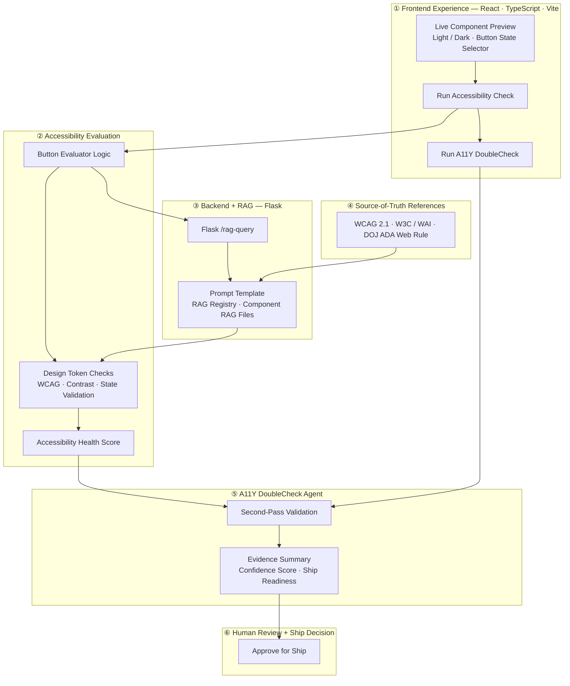

# OrchestratoR™ — MVP Architecture Diagram

## How it works

OrchestratoR™ lets a designer or engineer load a UI component into a live workspace, then instantly evaluate it against real accessibility standards.

**Frontend Experience** renders the component in configurable states — light/dark mode, button state variants — and triggers the accessibility pipeline with a single action.

**Accessibility Evaluation** runs the Button Evaluator Logic against design token checks, WCAG rules, contrast ratios, and component state validation, combining all results into an Accessibility Health Score.

**Backend + RAG** powers the evaluation with a Flask `/rag-query` endpoint that builds a prompt from a RAG registry of component-specific files and returns grounded, standards-backed findings.

**Source-of-Truth References** — WCAG 2.1, W3C/WAI guidance, and the DOJ ADA Web Rule — anchor the RAG registry so every finding is traceable to a published standard.

**A11Y DoubleCheck Agent** performs a second-pass review after the first-pass score is produced, generating an evidence summary, confidence score, and ship-readiness verdict.

**Human Review + Ship Decision** surfaces the agent's verdict to a human reviewer, who makes the final call to Approve for Ship.
